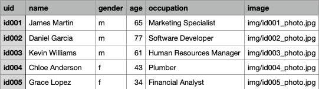

# Here comes the fuzz

This script takes a csv file as input. It generates a self-contained, easily configurable html file that allows for searching and filtering through the entries in the csv.

From a csv with the following structure (all data generated for demo purposes):



The script can generate a page that works like this:


## Features

- easily configurable with a single .toml file (see below)

- arbitrary number of search fields and checkboxes (Each can be made to match a field of choice in the csv. Multiple search fields and checkboxes can target the same field, but currently, a single search field cannot target multiple csv fields.)

- uses [Fuse.js](https://www.fusejs.io/) for optional fuzzy matching: search fields can be made to match csv contents strictly, or with a configurable tolerance for misspelling.

- copy button: copy the contents of any field to the clipboard

- image support: display images whose path is contained in one of the csv fields

- the resulting html page is self-contained (apart from images, which can be stored in any path of your choice). The page can be served on a website or used offline with any modern browser.

## Requirements

- python >= 3.11 (the script uses tomllib, which is built-in from this version upwards)

## Usage

1. Clone this repository or download the [latest release](https://github.com/rep2si/here-comes-the-fuzz/releases/latest).

2. Replace the demo `input.csv` with your own file (or specify the path to your file in the command invocation below).

3. Edit `config.toml` to suit your needs, (or specify the path to an alternative configuration file, see command invocation below).

4. Ensure the script is executable (`chmod +x /path/to/downloaded/here-comes-the-fuzz.py` on linux or macos. Replace with the actual path to the script).

5. Run the script: `./here-comes-the-fuzz.py -i input.csv -c config.toml -o output.html` You can omit the arguments if you use these default filenames, and the files are in the same directory as the script.

## Configuration

All configuration is done by editing `config.toml`.

```toml
[filters]

    [filters.uid]
    csv_col = "uid"
    type = "filter"
    text = "Filter by identifier"

    [filters.name]
    csv_col = "name"
    type = "fuzzy"
    text = "Fuzzy search by full name"
    threshold = 0.4

    [filters.gender]
    csv_col = "gender"
    type = "checkbox"
    text = "Filter by gender" # set to "" if no text desired
    options = ["m", "f"] # ensure these correspond to values in csv

    [filters.occupation]
    csv_col = "occupation"
    type = "fuzzy"
    text = "Fuzzy search by occupation"
    threshold = 0.4

[table]

    [table.col0]
    type = "image"
    width = 0.1
    img_max_height = 150
    img_max_width = 100
    header_text = "Photograph"
    csv_col = "image" # this col of csv should contain relative path of images

    [table.col1]
    type = "copy_button"
    width = 0.1
    header_text = "Copy ID"
    button_text = "Copy ID"
    csv_col_to_copy = "uid"

    [table.col2]
    type = "text"
    width = 0.1
    header_text = "Identifier"
    csv_col = "uid"

    [table.col3]
    type = "text"
    width = 0.3
    header_text = "Full Name"
    csv_col = "name"

    [table.col4]
    type = "text"
    width = 0.1
    header_text = "Gender"
    csv_col = "gender"

    [table.col5]
    type = "text"
    width = 0.1
    header_text = "Age"
    csv_col = "age"

    [table.col6]
    type = "text"
    width = 0.1
    header_text = "Occupation"
    csv_col = "occupation"

[misc]
title = "Here comes the fuzz"
```

Most options should be self-explanatory.

The first section, `[filters]` is where search fields and tickboxes are configured. Each subsection (e.g., `[filters.uid]` or `[filters.name]`) will generate either one search field, or one set of checkboxes. There is no limit to the number of subsections you can include, and the second part of the subsection name is arbitrary, i.e. you can use any `XXXX` in  `[filters.XXXX]`.

In each subsection, you must specify:

- `csv_col`: the variable / column in the csv which this block will target.

- `type`: can be one of `"fuzzy"` (search with tolerance for misspelling), `"filter"` (search with no tolerance for misspelling) or `"checkbox"` (tickboxes, useful for categorical data with limited levels). 

- `text`: This is the hint text that will be included in the search field before the user enters anything, or the text that will be included next to the checkboxes.

- for `"fuzzy"` types, you must specify a `threshold` value between 0.0 and 1.0. This is the [tolerance for misspelling](https://www.fusejs.io/api/options.html#threshold) that is passed to fuse.js behind the scenes. A threshold of 0.0 requires a perfect match (equivalent to `type = "filter"`) and a threshold of 1.0 matches anything.

- for `checkbox` types, you must include an `option` field. This must be an array (e.g. `options = ["m", "f"]`) whose values correspond to the levels that the variable can take in the csv. One checkbox is generated per item in the array.

The second section `[table]` is where the results table is configured. Each subsection (e.g. `[table.col0]` or `[table.col1]`) will generate a column in the results table. There is no limit to the number of columns you can include, and the second part of the subsection is aribrary, i.e. you can use any `XXXX` in `[table.XXXX]`.

In each sub-section, you must specify:

- `type`: can be one of `"text"` (displays content of csv as a string), `"copy_button"` or `"image"`

- `width`: should be a value between 0.0 and 1.0. This controls how wide the column will be. The sum of all `width` values should equal 1.0

- `header_text`: a string that will be used as the header for the column

- `csv_col`: the name of the column in the csv which this column should correspond to. This is not required for `"copy_button"` types.

- for `"copy_button"` types, you must specify `"button_text"` (the text that will be shown on the button) and `"csv_col_to_copy"` (the csv variable to copy).

- for `"image"` types, the csv should contain the path to the image. You must also specify `"img_max_height"` and `"img_max_width"`. Both of these values are in pixels. Note that the path should either be absolute or relative _to where the output.html file is located_. If you move the output.html file onto a tablet, those images (with appropriate paths in the original csv) will need to be copied over, as well. 

There is a third section, `[misc]`. This only contains the option `title`, which is a string that will be used as the page title.

## Example use case: offline identification of individuals in social network survey

_Note: The description below is most likely of interest only if you are using the script to collect social network data. If your use case is completely different, you should probably ignore this section. We use some social network research jargon below._

The script should support a fairly wide set of use cases. The demo files (`input.csv` and `config.toml`) demonstrate the use case out of which the script was born: identifying individuals in a community while eliciting social network data.

Imagine the following scenario: having conducted a census in a community of interest, you have a database with information about all its residents. The demo `input.csv` file on this repository contains fabricated data showing what such a database may look like. (Note that in the [rep2si](https://rep2si.github.io/) project, we used this script with databases containing an order of magnitude more observations and many more variables. The fabricated data in `input.csv` is simplified for demonstration purposes.)

While eliciting and identifying alters in a social network survey, you need a reliable way of identifying individuals that community members name as alters. In other words, you need a way of recovering the unique identifier (uid) that you have attributed to each community resident. You cannot rely on names alone because different community residents share the same name, and community residents cannot always recall each other's names precisely. Using this script, you generate an html page that you can, for example, upload to a tablet that you carry in the field, or give to your research assistants. When a respondent names an alter, the page which this script generates allows you to disambiguate them, recover their uid, and easily copy it to the clipboard for pasting in your survey instrument.

## Acknowledgements

The generated html file will include [fuse.js](https://www.fusejs.io/) in raw form. The entire script has to be included in the file itself as modern browsers' cross-scripting protection prevents loading this from a separate local file. 

Demo photos generated with [Face Studio](https://facestudio.app/). 

Many thanks to [Janey Tietz](https://github.com/janeytietz/), who helped draft an html page with a structure similar to what this script generates.